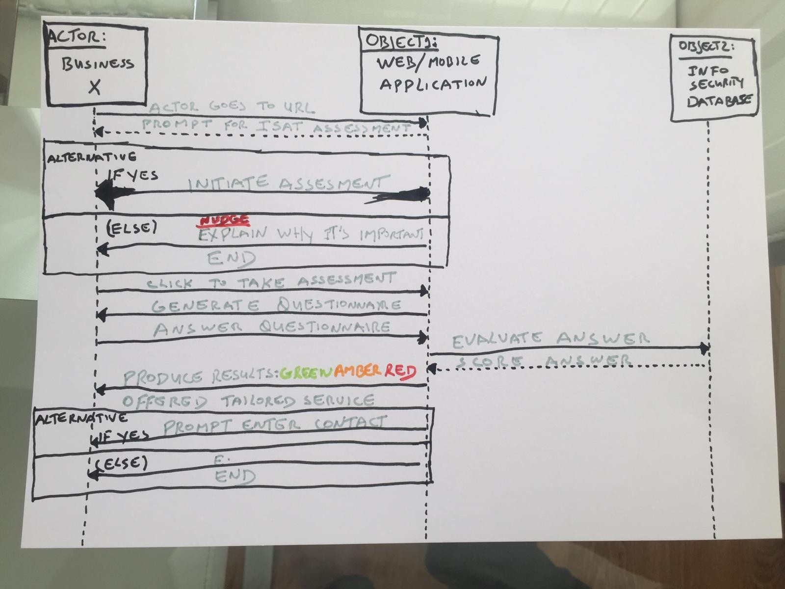
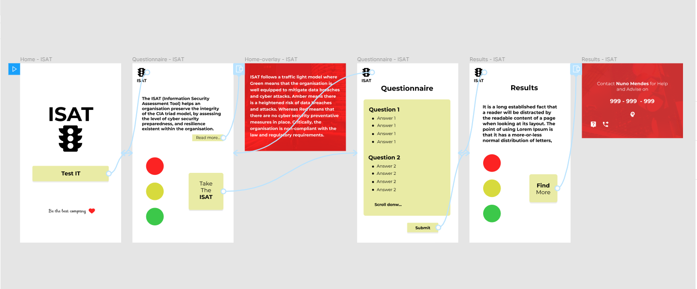
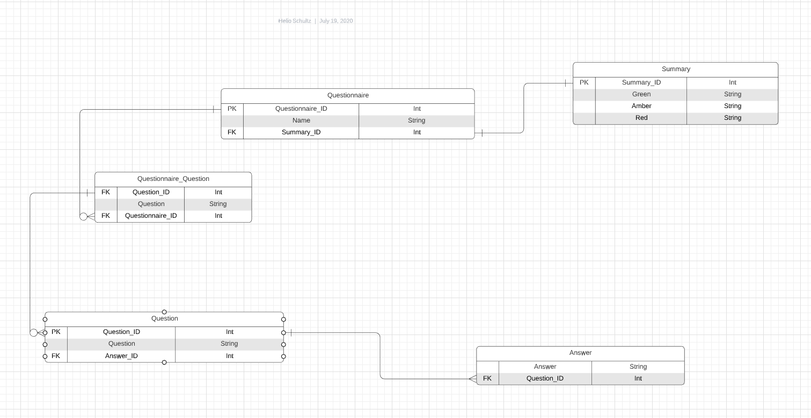

# Information-Security-Assessment-Tool

**Version 1.0.0**

In an increasingly and ubiquitous technological, connected, data driven world, data is fastly becoming the new currency. The value of an organisation is no longer determined by bricks and mortar assets but by the critical, sensitive and private information it holds. The value of data has increased exponentially, and technological advancements has meant that the storage of, and the access to the critical, sensitive and private information is done, almost in its entirety digitally and instantly. It follows, then, that in order for an organisation to keep its value, the confidentiality, the integrity and the availability (CIA triad model) of information must not be compromised.

The ISAT (Information Security Assessment Tool) helps an organisation preserve the integrity of the CIA triad model, by assessing the level of cyber security preparedness, and resilience existent within the organisation.

ISAT follows a traffic light model where Green means that the organisation is well equipped to mitigate data breaches and cyber attacks. Amber means there is a heightened risk of data breaches and attacks. Whereas Red means that there are no cyber security preventative measures in place. Critically, the organisation is non-compliant with the law and regulatory requirements.

By using the ISAT, organisations become much better equipped to respond and mitigate effectively information security challenges and cyber attacks. 

## ISAT Brief 

An attractive, effective and intuitive web application tool that evaluates the level of preparedness and resilience existent within an organisation, followed by well-formed recommendations to  prevent and mitigate data breaches and cyber attacks. In return, organisations become much better equipped to respond and mitigate effectively information security challenges and cyber attacks. 

## ISAT's Mission Statement

A bridge between your cyber security needs and industry leaders.

## How the web application works

ISAT follows a traffic light model with three possible results: Green, Amber and Red. Green means that the organisation is well equipped to mitigate data breaches and cyber attacks. Amber means there is a heightened risk of data breaches and attacks. Whereas Red means that there are no cyber security preventative measures in place. Critically, the organisation is non-compliant with the law and regulatory requirements.

ISAT is divided in two stages: For the first stage, there is no registration or sharing of sensitive information. The User simply fills in a brief questionnaire created to ascertain the level of preparedness and resilience of their organisation. The three possible results are Green, Amber and Red. Following the result, the user is advised accordingly. 

The second stage is in case there is a security issue. Here the User is given the option to sign-in for a service to address the issue/(s) indentified.

If there are no issues, the User can sign-in to our Newsletter or just leave the web application.

## Who are likely to benefit from using ISAT

Key decision makers, including C-Level Executives, Senior Management and other assigned individuals with responsibility for information/cyber security, governance, risk managment and compliance.

## UX Flowchart Draft 1

## WireFlow Draft 1

## ERD (Entity Relationship Diagram) Invest 

- <https://app.lucidchart.com/invitations/accept/334330a9-9a9e-4947-89ad-4647fba2b1b9> 

## Development of the web application

- Code based
- Laravel framework
- HTML

## Quality Control Procedures

- Quality Policy
- Quality Management Plan
- Quality Review Plan

## Marketing Strategy

- Set up a blog
- Write articles for cyber and infosec magazines
- Deliver a presentations at cyber and infosecevents

## Contributors

- Nuno Mendes <njtmendes@gmail.com>
- Helio Schultz <helioschultz_1@msn.com>

## How to contribute to the project

Please send an email to the contributors expressing your interest.

## License & Copyright

Nuno Mendes
